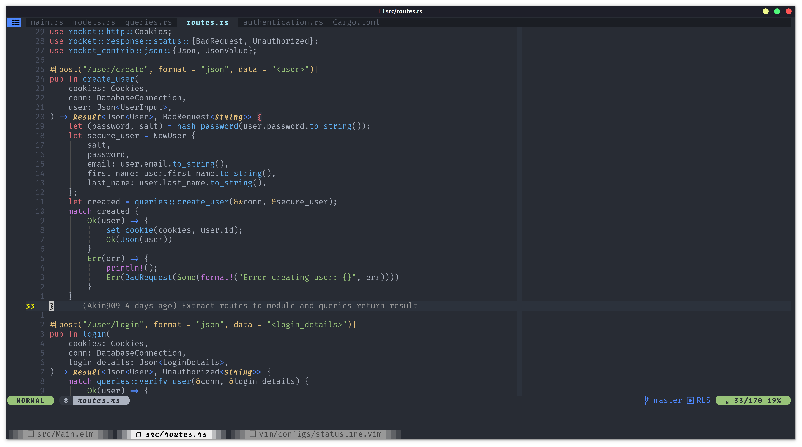

# .dotfiles



My dotfiles including _zsh_, _(n)vim_ and _tmux_ config files (stashed away in case of laptop armageddon).

I thought I'd document for myself and for others potentially some of the setup
involved in the various programs my dotfiles cover.
⚠ Warning: This stuff has worked for me but may not be universal.

### Setup

TBC: Currently considering and automated system like `chezmoi`

### Organisation

After struggling with a 2500+ line long `init.vim` I finally decided to bite the
bullet and modularise my `init.vim`.

Having taken a look at several patterns on line I decided on the following approach
My `init.vim` is essentially a hub of links to the various sections of my configuration.

These are divided into:

- Autocommands
- Mappings
- General settings
- Plugins (home made or stolen vimscript)

I then further modularised/succumbed to the Internet's suggestion to avoid
over using Autocommands and use **Vim's after** directory.

Small explainer if this is news to you. Vim loads different files depending on their location in its directory, for example autoloading scripts load on
demand/lazily. Filetype plugins run when a file type is opened. `after/ftplugins` do open after plugins and regular filetype
files have run.

This lets me have the last word on the settings per filetype after the plugins
have run and the filetype files from Vim so my settings definitely show up.

```vim
  .vim/
    autoload/
    ftplugin/
    plugins/
    bundle/
    after/
      /ftplugins
        /myFile
```

### Autoload Directory

As I mentioned above this directory allows a Vim user
to lazy load utility functions which given the number
and size of a users functions can improve startup.

In my case I've symlinked the (n)vim directory to `$HOME/config/nvim`.
