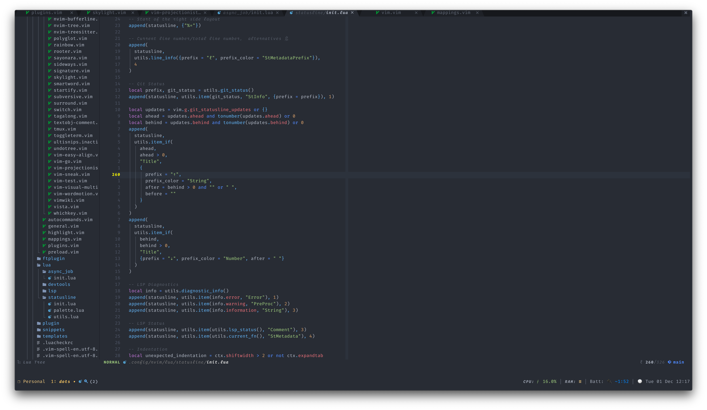

# .dotfiles



My dotfiles including _zsh_, _(n)vim_ and _tmux_ config files (stashed away in case of laptop armageddon).

I thought I'd document for myself and for others potentially some of the setup
involved in the various programs my dotfiles cover.

### Installation

```
curl -s https://raw.githubusercontent.com/akinsho/dotfiles/master/install.sh | bash
```

### Highlights / Tools

- [Kitty](https://sw.kovidgoyal.net/kitty/index.html)/[Alacritty](https://github.com/alacritty/alacritty) GPU accelerated terminal emulators
- [Nvim (nightly)](https://github.com/neovim/neovim)
- Language server support using [`neovim's lsp`](https://neovim.io/doc/user/lsp.html)

- Minimal Zsh config without `oh-my-zsh`, async prompt for really large monorepos.

  

I _strongly_ advise against forking or cloning this repo. It isn't a distro it's only intended for my personal usage.

### Setup

Setup is managed using [dotbot](https://github.com/anishathalye/dotbot). To setup symlinks run
`./install` in the root directory of the repository

This package manages symlinking my config files to the correct directories.
It's a little more complex than `GNU Stow` but much less than `Ansible`
