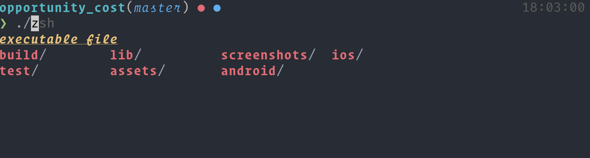

# .dotfiles

My dotfiles including _zsh_, _(n)vim_ and _tmux_ config files (stashed away in case of laptop armageddon).

I thought I'd document for myself and for others potentially some of the setup
involved in the programs my dotfiles cover.

### Installation

The installation script is out of date and doesn't work anymore.
To setup a new machine instead follow these instructions:
1. Check `git` is installed.
2. (Mac OS) Install homebrew using the most recent instructions.

#### dependencies:
* `neovim`
* `hombrew` (MacOS)
* `ripgrep`
* `fzf`
* `delta`
* `prettier`
* `stylua`
* `himalaya`

### Highlights / Tools

- [Kitty](https://sw.kovidgoyal.net/kitty/index.html)/[Alacritty](https://github.com/alacritty/alacritty) GPU accelerated terminal emulators
- [Nvim (nightly)](https://github.com/neovim/neovim)
- Language server support using [`neovim's lsp`](https://neovim.io/doc/user/lsp.html)

- Minimal Zsh config without `oh-my-zsh`, async prompt for large monorepos.

  

Please **DO NOT** fork or clone this repo. It isn't a distro it's intended for my personal usage, and perhaps
some inspiration, _not complete duplication_. If you see something weird or wrong please raise an issue instead.

### Setup

I manage my setup using [dotbot](https://github.com/anishathalye/dotbot). To setup symlinks run
`./install` in the root directory of the repository

This package manages symlinking my config files to the correct directories.
It's a little more complex than `GNU Stow` but much less than `Ansible`
